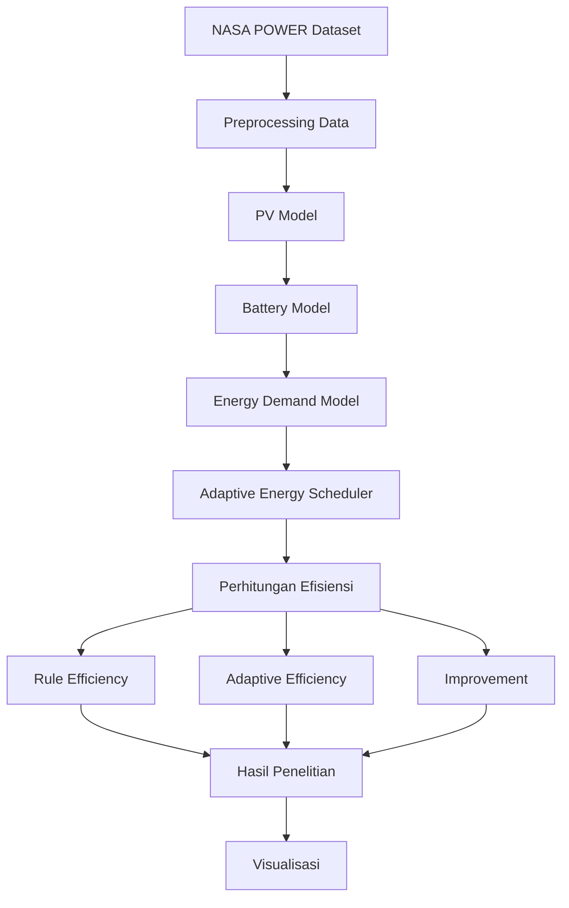
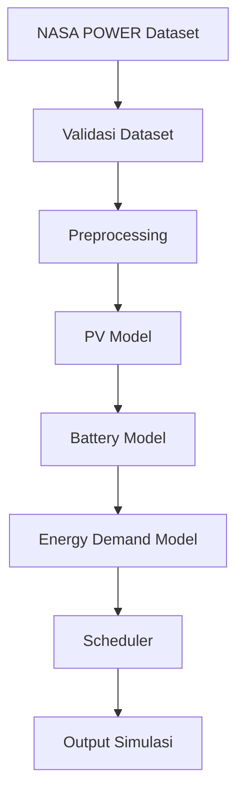
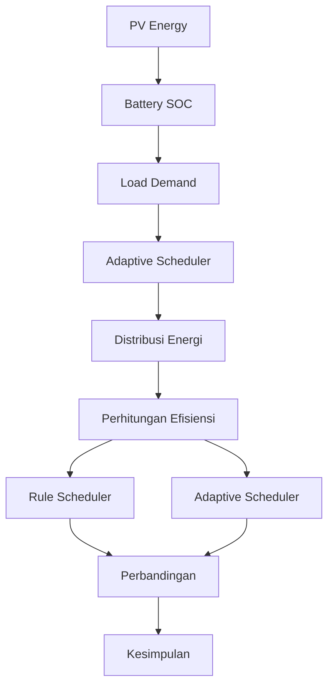

# 03-teori

Dokumen ini menjelaskan arsitektur sistem, desain penelitian, variabel penelitian, serta landasan teori yang digunakan sebagai dasar implementasi **Adaptive Energy Scheduler** berbasis panel surya pada sistem hidroponik cerdas.

**Judul Penelitian:**

**Evaluasi Performa Desain Integrasi IoT Holistik dengan Adaptive Energy Scheduler Berbasis Panel Surya pada Sistem Hidroponik Cerdas di Kondisi Fluktuasi Energi Daerah Terpencil**

**Status:** Selesai (Tahap Perancangan Sistem, Implementasi Simulasi, dan Evaluasi)

---

# 1. Arsitektur Komponen Sistem

Penelitian ini merupakan penelitian eksperimen berbasis simulasi yang mengintegrasikan **Internet of Things (IoT)**, **Photovoltaic (PV)**, **Battery Model**, **Energy Demand Model**, dan **Adaptive Energy Scheduler**.

Data radiasi matahari diperoleh dari **NASA POWER** kemudian diproses menjadi energi listrik panel surya. Energi tersebut dikelola oleh Battery Model dan Adaptive Energy Scheduler sebelum digunakan untuk memenuhi kebutuhan energi sistem hidroponik.

---

# 2. Alur Pengolahan Data

Tahapan penelitian dimulai dari pengambilan data cuaca NASA POWER, kemudian dilakukan preprocessing sebelum digunakan untuk simulasi produksi energi panel surya.

---

# 3. Alur Adaptive Energy Scheduler

Scheduler bertugas menentukan distribusi energi berdasarkan kondisi produksi panel surya, kapasitas baterai, dan kebutuhan energi beban.

---

# 4. Desain Variabel Penelitian

## 4.1 Variabel Independen

Variabel bebas merupakan komponen utama yang memengaruhi proses simulasi.

| Variabel | Jenis | Keterangan |
|----------|------|------------|
| Intensitas Radiasi Matahari | Independent | Data NASA POWER |
| PV Model | Independent | Menghasilkan energi panel surya |
| Battery Model | Independent | Mengelola energi baterai |
| Adaptive Energy Scheduler | Independent | Mengatur distribusi energi |

---

## 4.2 Variabel Dependen

Variabel yang diamati selama penelitian.

| Variabel | Keterangan |
|----------|------------|
| Rule Efficiency | Efisiensi metode Rule-Based |
| Adaptive Efficiency | Efisiensi metode Adaptive |
| Improvement | Persentase peningkatan efisiensi |
| State of Charge | Kondisi baterai |

---

## 4.3 Variabel Kontrol

| Variabel | Nilai |
|----------|-------|
| Dataset | NASA POWER |
| Periode | Januari–Desember 2024 |
| Jumlah Data | 8.784 data |
| Simulasi | Python |
| Scheduler | Rule dan Adaptive |

---

# 5. Struktur Sistem

---

# 6. Landasan Teori

## 6.1 Smart Agriculture

Smart Agriculture merupakan konsep pertanian modern yang memanfaatkan teknologi digital untuk meningkatkan efisiensi, produktivitas, dan keberlanjutan sektor pertanian. Teknologi seperti sensor, IoT, dan analisis data memungkinkan proses budidaya dilakukan secara lebih presisi.

---

## 6.2 Smart Hydroponic

Smart Hydroponic merupakan pengembangan sistem hidroponik yang mengintegrasikan sensor, aktuator, dan komunikasi data untuk memonitor kondisi tanaman secara otomatis, seperti suhu, kelembapan, pH, nutrisi, dan ketinggian air.

---

## 6.3 Internet of Things (IoT)

Internet of Things (IoT) merupakan teknologi yang menghubungkan perangkat fisik melalui jaringan internet sehingga mampu melakukan proses monitoring, pengumpulan data, dan pengendalian secara real-time.

---

## 6.4 Renewable Energy

Energi terbarukan merupakan sumber energi yang berasal dari proses alam yang dapat diperbarui secara berkelanjutan. Pada penelitian ini digunakan energi surya sebagai sumber energi utama sistem hidroponik.

---

## 6.5 Photovoltaic (PV)

Photovoltaic merupakan teknologi yang mengubah energi cahaya matahari menjadi energi listrik melalui sel surya. Besarnya energi yang dihasilkan dipengaruhi oleh intensitas radiasi matahari, suhu lingkungan, dan efisiensi panel surya.

---

## 6.6 Battery Management System

Battery Management System (BMS) merupakan sistem yang mengelola proses pengisian dan pengosongan baterai sehingga energi dapat dimanfaatkan secara optimal sekaligus menjaga umur pakai baterai.

---

## 6.7 Energy Management System

Energy Management System merupakan metode pengelolaan energi yang bertujuan mengoptimalkan distribusi energi dari berbagai sumber agar kebutuhan beban dapat terpenuhi secara efisien.

---

## 6.8 Adaptive Energy Scheduler

Adaptive Energy Scheduler merupakan mekanisme pengambilan keputusan yang menyesuaikan distribusi energi berdasarkan produksi energi panel surya, kondisi baterai (*State of Charge*), dan kebutuhan energi beban sehingga penggunaan energi menjadi lebih efisien dibandingkan metode Rule-Based.

---

## 6.9 NASA POWER

NASA POWER merupakan layanan data iklim dan radiasi matahari yang menyediakan informasi historis seperti intensitas radiasi matahari, suhu udara, kelembapan, dan kecepatan angin yang banyak digunakan pada penelitian energi terbarukan.

---

# 7. Evaluasi Sistem

Kinerja sistem dievaluasi menggunakan beberapa parameter berikut.

## Rule Efficiency

Mengukur efisiensi sistem menggunakan Rule-Based Scheduler.

---

## Adaptive Efficiency

Mengukur efisiensi sistem menggunakan Adaptive Energy Scheduler.

---

## Improvement

Mengukur peningkatan efisiensi Adaptive Scheduler dibandingkan Rule-Based Scheduler.

---

## State of Charge (SOC)

Mengukur kondisi kapasitas baterai selama proses simulasi.

---

# 8. Keputusan Desain Penelitian

| Aspek | Keputusan | Justifikasi |
|-------|-----------|-------------|
| Dataset | NASA POWER | Data radiasi matahari historis |
| PV Model | Digunakan | Menghitung produksi energi |
| Battery Model | Digunakan | Mengelola energi baterai |
| Energy Demand Model | Digunakan | Menghitung kebutuhan energi |
| Scheduler | Rule dan Adaptive | Sebagai pembanding |
| Bahasa Pemrograman | Python | Simulasi numerik |
| Evaluasi | Rule Efficiency, Adaptive Efficiency, Improvement | Mengukur performa sistem |

---

# 9. Mapping Implementasi Kode

| Komponen | Implementasi |
|----------|--------------|
| Dataset Loader | Pandas |
| Preprocessing | NumPy |
| PV Model | pv_model.py |
| Battery Model | battery_model.py |
| Energy Demand Model | load_model.py |
| Scheduler | experiment_final_part3.py |
| Evaluasi | experiment_final_part4.py |
| Visualisasi | Matplotlib |
| Output | CSV, XLSX, PNG |

---

# 10. Referensi

- Wardhana, A. S., Ferdiansyah, M., & Kholifah, S. K. (2025). *Desain dan Prototipe Integrasi IoT dalam Pertanian Hidroponik Cerdas Berbasis Energi Terbarukan.*

- Austria, A. C., et al. (2023). *Development of IoT Smart Greenhouse System for Hydroponic Gardens.*

- Almalki, F. A. (2021). *A Low-Cost Platform for Environmental Smart Farming Monitoring System Based on IoT and UAVs.*

- NASA POWER Project Documentation.

- Azuatalam, D., et al. *Energy Management Strategies for PV-Battery Systems.*

---

# 11. Navigasi Repository

| Folder | Keterangan |
|--------|------------|
| 00-admin | Administrasi Penelitian |
| 01-proposal | Proposal Penelitian |
| 02-literatur | Studi Literatur |
| 04-data | Dataset NASA POWER |
| 05-kode | Implementasi Sistem |
| 06-output | Hasil Eksperimen |
| 07-manuskrip | Manuskrip |
| 08-laporan | Laporan |
| 09-docs | Dokumentasi |

---

# Ringkasan

Penelitian ini mengembangkan **Adaptive Energy Scheduler** berbasis panel surya untuk sistem hidroponik cerdas dengan mengintegrasikan **NASA POWER Dataset**, **PV Model**, **Battery Model**, dan **Energy Demand Model**. Kinerja sistem dievaluasi melalui perbandingan **Rule-Based Scheduler** dan **Adaptive Energy Scheduler** menggunakan metrik **Rule Efficiency**, **Adaptive Efficiency**, **Improvement**, serta **State of Charge (SOC)**. Pendekatan ini diharapkan mampu meningkatkan efisiensi pengelolaan energi pada sistem hidroponik yang beroperasi di daerah dengan fluktuasi ketersediaan energi.
